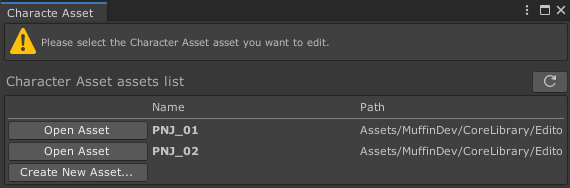

# Muffin Dev for Unity - Editable Assets

Utility classes to draw GUI for *editable assets*.

## Summary

- [`EditableAssetEditorGUI`](./editable-asset-editor-gui.md): Utility to draw GUI for *editable assets*. If no asset is opened (or selected), it draws a list of all the assets of the given type that exists in the project, allowing user to create or open one
- [`EditableAssetEditor`](./editable-assets-editor.md): Shortcut for making editable assets custom inspector editor
- [`EditableAssetEditorGUI`](./editable-assets-editor-gui.md): Utility to draw GUI for editable assets
- [`EditableAssetEditorWindow`](./editable-assets-editor-window.md): Shortcut for making editable assets editor windows, which updates the GUI depending on the selection
- [`EditableAssetsList`](./editable-assets-list): GUI utility to display a list of assets that can be edited using a custom editor