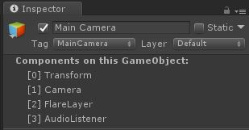

# Muffin Dev for Unity - `GameObjectExtensionEditor`

Utility class to inherit for making `GameObject` editor extensions.

This is based on the Work of Lucas Guibert, who made a multi-tags system for GameObjects:

- [Lucas Guibert's Multi-Tags extension](https://github.com/LucasJoestar/Multi-Tags)
- [More about extending Editor class inspectors (FR)](https://docs.google.com/document/d/1Ql_IPvYrfzT3Jep0-k2SzJlX6q2r48xG4sN_aiv_CqA/edit#heading=h.1zj7cjedrug2)

## Usage

Inheritors of this class must use the attribute `[CustomEditor(typeof(GameObject))]` in order to apply changes to any `GameObject` inspector view.

The following example script is a short version of the `GameObjectExtensionDemoEditor` you can find in *MuffinDev/Core/Editor/Demos*.

```cs
using UnityEngine;
using UnityEditor;

using MuffinDev.Core.EditorOnly;

[CustomEditor(typeof(GameObject))]
public class GameObjectExtensionExample : GameObjectExtensionEditor
{

    public override void OnInspectorGUI()
    {
        base.OnInspectorGUI();

        EditorGUILayout.LabelField("Components on this GameObject:", EditorStyles.boldLabel);
        EditorGUI.indentLevel++;
        Component[] components = Target.GetComponents<Component>();
        for(int i = 0; i < components.Length; i++)
        {
            EditorGUILayout.LabelField(string.Format("[{0}] {1}", i, components[i].GetType().Name));
        }
        EditorGUI.indentLevel--;
    }

}
```

While this script is in your *Assets/* folder, all your `GameObjects` will have a list of all their components in the inspector.



## How does it works?

If you just make a custom `Editor` class marked with `[CustomEditor(typeof(GameObject))]`, you will totally override the existing inspector view for `GameObject`. And even if you use `base.OnInspectorGUI()` when overriding that method, you will get a bad result.

So, to make an extension for `GameObject`, you have to get the existing inspector view, then add your own content.

This class uses [`Editor.CreateEditor()`](https://docs.unity3d.com/ScriptReference/Editor.CreateEditor.html) method to get that existing inspector view.

`GameObjectExtensionEditor` overrides for you `OnInspectorGUI()` and `OnHeaderGUI()`, using base header and inspector view of `GameObject`.

## Methods

```cs
protected override void OnEnable()
```

Called when an instance of this `Editor` class is loaded. Gets the existing inspector view for `GameObject`, and stores it.

---

```cs
protected virtual void OnDisable()
```

Called before the instance of this `Editor` class is destroyed. Call `OnDisable()` on the stored `GameObject` inspector view before destroying this instance.

---

```cs
public override void OnInspectorGUI()
```

Draws the default `GameObject` inspector view.

---

```cs
protected override void OnHeaderGUI()
```

Draws the default `GameObject` header in inspector.