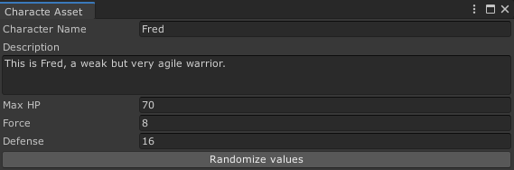

# Muffin Dev for Unity - `EditableAssetEditorGUI<TAssetType>`

Utility to draw GUI for editable assets. If no asset is opened (or selected), it draws a list of all the assets of the given type that exists in the project, allowing user to create or open one.

Note that this custom editor GUI doesn't inherit from `Editor`, `EditorWindow` or any custom editor built-in class. This utility is meant to create an editor view that can be used in several contexts. As an example, see the demo below. The custom editor of `Character Assets` is the same in the editor window and in the inspector.

After setting up that GUI, **you'll have only one class to edit if you want to change the GUI of your editor tools**, instead of editing both windows and custom inspectors.

## Demo

The demo of this utility is grouped with the demo of [`EditableAssetsList`](./editable-assets-list.md), which is used to draw the assets list by this class. As an example, you'll find a `Character Asset` scriptable object that just contains basic values for a character: name, description and RPG-like values.

Since you're not currently selecting one of these assets, you can open the editor window from `Tools > Muffin Dev > Demos > Character Asset Editor`.


The list of all `Character Asset` in your project will appear. You can create new one from `Assets > Create > Muffin Dev > Demos > Character Asset`, or using the *Create New Asset...* button on the editor window. Opening one of these assets by selecting them or clicking on the *Open Asset* button will display the asset editor in the same window.



Note that this editor is the same in the window and in the *Inspector*.

## Usage

As said in the introduction above, this GUI utility is meant to be used in several contexts. So in the following guide, you'll learn how to create a custom editor GUI that can be used in both an editor window and in the *Inspector*.

### Create the ediable asset

As an example, create a script `Monster` which is an asset that represents the stats of a monster in a game. Since it's an asset, you can make it inherit from `ScriptableObject`

```cs
using UnityEngine;
public class Monster : ScriptableObject
{
    public int hp;
    public int force;
    public int defense;
}
```

### Create the editor GUI

Create the `Monster` asset editor GUI in order to use it in a custom editor class. To do so, just inherit from `EditableAssetEditorGUI`:

```cs
using UnityEngine;
using MuffinDev.Core.EditorOnly;
public class MonsterEditorGUI : EditableAssetEditorGUI<Monster>
{
    // Override base constructor.
    public MonsterEditorGUI(Monster _Asset, System.Action _RepaintCallback = null)
        : base(_Asset, _RepaintCallback) { }

    protected override void DrawAssetGUI()
    {
        base.DrawAssetGUI();

        // Add a button to randomize the monster stats
        if (GUILayout.Button("Randomize values"))
        {
            serializedObject.FindProperty("hp").intValue = Random.Range(50, 200);
            serializedObject.FindProperty("force").intValue = Random.Range(3, 30);
            serializedObject.FindProperty("defense").intValue = Random.Range(3, 30);
            serializedObject.ApplyModifiedProperties();
        }
    }
}
```

### Use the editor GUI inside an `EditorWindow`

You can now create an `EditorWindow` to create a utility to edit the `Monster` assets.

```cs
using UnityEditor;
public class MonsterEditorWindow : EditorWindow
{
	private MonsterEditorGUI gui;

	private void OnEnable()
	{
		// Initialize the Charcter Assets editor GUI
		gui = new MonsterEditorGUI(null, Repaint);

		// Make the window display the settings of the selected Character asset, even if the selection changes
		OnSelectionChange();
		Selection.selectionChanged += OnSelectionChange;
	}

	private void OnDisable()
	{
		Selection.selectionChanged -= OnSelectionChange;
	}

	private void OnGUI()
	{
		// Draw the Character assets list, or the selected asset's editor
		gui.DrawGUI();
	}

	// Focuses the window of this tool, or create it if it's not already open.
	[MenuItem("Demos/Monster Editor")]
	private static void ShowWindow()
	{
		// Open and focus the Monster Editor window
		GetWindow<MonsterEditorWindow>(false, "Monster Editor", true)
			.Show();
	}

	// Called when the selected object changes, so the window will display the editor of the selected asset
	private void OnSelectionChange()
	{
		if (Selection.activeObject is Monster)
			gui.Asset = Selection.activeObject as Monster;
	}
}
```

Open this window from `Demos > Monster Editor`, and so you can open or create `Monster` assets.

### Use the editor GUI inside a custom editor

You can also use the editor GUI to create a custom inspector, and so display the same editor as your window in the *Inspector*.

```cs
using UnityEditor;
using MuffinDev.Core.EditorOnly;
[CustomEditor(typeof(Monster))]
public class MonsterEditor : TEditor<Monster>
{
	private MonsterEditorGUI gui = null;

	private void OnEnable()
	{
		// Initialize the asset's editor GUI
		gui = new MonsterEditorGUI(Target, Repaint);
	}

	public override void OnInspectorGUI()
	{
		// Draw the asset's editor GUI
		gui.DrawGUI();
	}
}
```

## Constructor

```cs
public EditableAssetEditorGUI(TAssetType _Asset = null, System.Action _RepaintCallback = null)
```

Creates an editor GUI for custom editable assets.

- `TAssetType _Asset = null`: The asset which you want to display the editor.
- `System.Action _RepaintCallback = null`: Optional callback to trigger when the content is repainted.

## Public API

### Methods

#### `DrawGUI()`

```cs
public void DrawGUI()
```

Draws the assets list if the asset is not already opened, otherwise draws the asset GUI.

#### `Repaint()`

```cs
public void Repaint()
```

Requires the editor view to repaint (by calling the Repaint Callback).

#### `BuildVisualElement()`

```cs
public virtual VisualElement BuildVisualElement()
```

Builds a VisualElement, for using this UI with UIElements API.

#### `DrawAssetGUI()`

```cs
protected virtual void DrawAssetGUI()
```

Draws the GUI of the opened asset. Note that this method is called from `DrawGUI()`, and by default the asset is not null at this step.

### Accessors

#### `Asset`

```cs
public TAssetType Asset { get; set; }
public TAssetType Target { get; set; }
public TAssetType target { get; set; }
```

Gets the editable assets list, in order to create or open one.

#### `SerializedAsset`

```cs
protected SerializedObject SerializedAsset { get; }
protected SerializedObject serializedObject { get; }
```

Gets the serialized object that represents the opened asset.

#### `AssetsListGUI`

```cs
protected EditableAssetsList<TAssetType> AssetsListGUI { get; }
```

Gets the editable assets list, in order to create or open one.