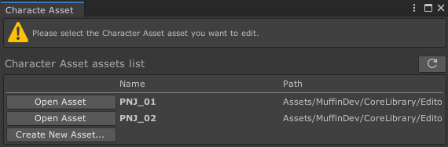

# Muffin Dev for Unity - `EditableAssetsList<T>`

Editor GUI utility to display a list of assets that can be edited using a custom editor.

## Demo

The demo of this utility is grouped with the demo of [`EditableAssetEditorGUI`](./editable-asset-editor-gui.md), which actually uses this class. As an example, you'll find a `Character Asset` scriptable object that just contains basic values for a character: name, description and RPG-like values.

Since you're not currently selecting one of these assets, you can open the editor window from `Tools > Muffin Dev > Demos > Character Asset Editor`.



The list of all `Character Asset` in your project will appear. You can create new one from `Assets > Create > Muffin Dev > Demos > Character Asset`, or using the *Create New Asset...* button on the editor window. Opening one of these assets by selecting them or clicking on the *Open Asset* button will display the asset editor in the same window.

## Usage

In a custom editor (for example `Editor` or `EditorWindow`), you can just create a variable of type `EditableAssetsList<T>`, where `T` is the type of the asset that can be opened or created.

### Create the ediable asset

As an example, create a script `Monster` which is an asset that represents the stats of a monster in a game. Since it's an asset, you can make it inherit from `ScriptableObject`

```cs
using UnityEngine;
public class Monster : ScriptableObject
{
    public int hp;
    public int force;
    public int defense;
}
```

### Display the list in an editor window

Now, create a `MonsterEditorWindow` script inside an `/Editor` directory, that will define an editor window for the `Monster` asset.

```cs
using UnityEngine;
using UnityEditor;
using MuffinDev.Core.EditorOnly;
public class MonsterEditorWindow : EditorWindow
{
    private EditableAssetsList<Monster> listGUI;
    private Monster openAsset = null;

    private void OnEnable()
    {
        // Initialize the assets list
        listGUI = new EditableAssetsList<Monster>(selectedAsset => openAsset = selectedAsset);
    }

    private void OnGUI()
    {
        // Draw the assets list if no asset has been opened yet
        if (openAsset == null)
        {
            listGUI.DrawLayout();
        }
        // Draw the default inspector for the opened asset
        else
        {
            EditorHelpers.DrawDefaultInspector(openAsset);

            // Add a button to cancel selection, and go back to the assets list
            EditorGUILayout.Space();
            if (GUILayout.Button("Close asset"))
            {
                openAsset = null;
            }
        }
    }

    [MenuItem("Demos/Monster Editor")]
    public static void ShowWindow()
    {
        // Open and focus the Monster Editor window
        GetWindow<MonsterEditorWindow>(false, "Monster Editor", true)
            .Show();
    }
}
```

Open the editor window from `Demos > Monster Editor`, and create/open your editable assets as you want!

## Constructor

```cs
public EditableAssetsList(OpenAssetDelegate _OnOpenAsset, bool _AutoOpenCreatedAsset = true, bool _AllowCreate = true, bool _AutoSelectOpenedAsset = true);
public EditableAssetsList(bool _AutoOpenCreatedAsset = true, bool _AllowCreate = true, bool _AutoSelectOpenedAsset = true);
```

Class constructor.

- `OpenAssetDelegate _OnOpenAsset`: The method to call when an asset is opened.
- `bool _AutoOpenCreatedAsset = true`: If `true`, an opened asset will automatically be selected in the editor, and pinged in the *Project* window.
- `bool _AllowCreate = true`: If `true`, draws a *Create New Asset* button that allow user to create new assets directly from the GUI.
- `bool _AutoSelectOpenedAsset = true`: If `true`, a new created asset will automatically be opened. Used only if *Allow Create* is set to `true`.

## Public API

### Delegates

#### `OpenAssetDelegate`

```cs
public delegate void OpenAssetDelegate(T _Asset)
```

Invoked when an asset is opened.

- `T _Asset`: The opened asset.

### Methods

#### `DrawLayout()`

```cs
public void DrawLayout()
```

Draws the Assets List GUI, using Layout methods.

#### `Refresh()`

```cs
public void Refresh()
```

Refreshes the displayed assets list.

### Accessors

#### `AutoOpenCreatedAsset`

```cs
public bool AutoOpenCreatedAsset { get; set; }
```

If `true`, an opened asset will automatically be selected in the editor, and pinged in the *Project* window.

#### `AllowCreate`

```cs
public bool AllowCreate { get; set; }
```

If `true`, draws a *Create New Asset* button that allow user to create new assets directly from the GUI.

#### `AutoSelectOpenedAsset`

```cs
public bool AutoSelectOpenedAsset { get; set; }
```

If `true`, a new created asset will automatically be opened. Used only if *Allow Create* is set to `true`.

#### `OnOpenAsset`

```cs
public OpenAssetDelegate OnOpenAsset { get; }
```

Invoked when an asset is opened.

#### `Assets`

```cs
public T[] Assets { get; }
```

Gets the list of all assets of the target type in this project.