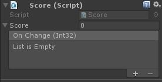

# Muffin Dev for Unity - Core - Observables

Implementation of *observer* pattern for properties and serialized properties to display in the inspector.

## Usage

This "Unity-friendly" implementation of the *observer* pattern allows you to make a property observable, which means any "observer" of that property will be notified of its changes.

For example, if you have a scoring implementation, you probably have an object that contains the "score" property, and a UI element to display that value. Instead of scripting the fact that when your score changes, so UI is updated, you can do it directly in the editor with observables.

```cs
using UnityEngine;
public class Score : MonoBehaviour
{
    public ObservableInt score;
}
```

With this kind of serialized property, you will get this field in the editor:



If you click on the arrow at the left of the field, you can see a `UnityEvent` field. The callbacks added to this field will be called each time the value of the "score" property changes.

This example uses `ObservableString`, but see below to check for the other supported types.

## Make your own Observable

There's some observable classes for primitive types already implemented in this module (`string`, `float`, `Vector2`, ...), but you can make your own observable.

You can inherit from classes [`Observable<T>`](./observable.md) for making observable properties that are not meant to be displayed in the inspector, or from [`ObservableSerialized<T, U>`](./observable-serialized.md) for serialized properties.

See the documentation of these classes to learn how to make your own observables.

[=> `Observable<T>` class documentation](./observable.md)
[=> `ObservableSerialized<T, U>` class documentation](./observable-serialized.md)

## Summary

### Base classes

- [`Observable<T>`](./observable.md): Base class for making observable values properties
- [`ObservableChanges<T>`](./observable-changes.md): Represents an observable value change
- [`ObservableSerialized<T, U>`](./observable-serialized.md): Shortcut for making an `Observable` for a serializable property
- [`ObservableDrawer<T>`](./observable-drawer.md): Base class for making a PropertyDrawer for an serialized Observable property

### Implementation classes

- [`ObservableBool`](./observable-bool.md): Represents an observable boolean property
- [`ObservableFloat`](./observable-float.md): Represents an observable `float` property
- [`ObservableInt`](./observable-int.md): Represents an observable integer property
- [`ObservableString`](./observable-string.md): Represents an observable `string` property
- [`ObservableVector2`](./observable-vector2.md): Represents an observable `Vector2` property
- [`ObservableVector3`](./observable-vector3.md): Represents an observable `Vector3` property

- [`ObservableBoolDrawer`](./observable-bool-drawer.md): Property drawer for `ObservableBool` properties
- [`ObservableFloatDrawer`](./observable-float-drawer.md): Property drawer for `ObservableFloat` properties
- [`ObservableIntDrawer`](./observable-int-drawer.md): Property drawer for `ObservableInt` properties
- [`ObservableStringDrawer`](./observable-string-drawer.md): Property drawer for `ObservableString` properties
- [`ObservableVector2Drawer`](./observable-vector2-drawer.md): Property drawer for `ObservableVector2` properties
- [`ObservableVector3Drawer`](./observable-vector3-drawer.md): Property drawer for `ObservableVector3` properties