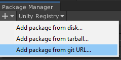

# Muffin Dev for Unity - Core

This module contains the main *Muffin Dev* library features. It also contains basic classes that other Muffin Dev modules could use.

**Most of other Muffin Dev modules need this library to work.**

## Installation

You can import this package in your Unity project by importing it from the *Package Manager*, or by just downloading it from this repository.

### Import from *Package Manager*

In Unity, go to `Window > Package Manager`. Click on the *Add* button in the top-left corner of the window, and select ***Add package from git URL...***.

Enter the URL to this repository in the taxt field (https://gitlab.com/muffin-dev/unity/standalone/core-library.git), click *Add*, and wait for the package to be installed.

Once installed, you should see the *CoreLibrary* directory appear in your project's `/Packages` directory!

## Documentation

[=> See module documentation](./Documentation~/README.md)

## Original version

This package is a "standalone" version of [the original *Muffin Dev for Unity* library](https://gitlab.com/muffin-dev/unity). [See the original repository](https://gitlab.com/muffin-dev/unity) to discover some other features of the *Muffin Dev* libraries!

## License

This library uses the [Creative Commons Attribution-ShareAlike 4.0 International license (CC BY-SA 4.0)](https://creativecommons.org/licenses/by-sa/4.0/legalcode).

This means that you can use, share and modify the assets, code and other files as you want (even for commercial projects, but only under the following terms:

- Give an "appropriate credit" (name the authors), and write a link to this package
- If the source package is modified, you must distribute your contibutions under the same license ([CC BY-SA 4.0](https://creativecommons.org/licenses/by-sa/4.0/legalcode))

### Links

- [More "readable" informations about the CC BY-SA 4.0 license](https://creativecommons.org/licenses/by-sa/4.0)
- [Legal CC BY-SA 4.0 license text](https://creativecommons.org/licenses/by-sa/4.0/legalcode)

## Support the project!

Did you find this content useful? The project is open source, but if you want to support my work, please consider buying me a coffee!

