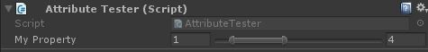

# Muffin Dev for Unity - `RangeMinMaxAttribute`

Draws a `MinMaxSlider` field for setting a minimum and a maximum value between a given range.

**This property can only be used on `Vector2` properties:**

* X axis is minimum
* Y axis is maximum

## Usage

```cs
public class AttributeTester : MonoBehaviour
{
    [RangeMinMax(0f, 10f)]
    public Vector2 myProperty = new Vector2(1f, 4f);
}
```



## Classes

### `RangeMinMaxAttribute`

```cs
public class RangeMinMaxAttribute : PropertyAttribute
```

Contains all settings for the custom property drawer (see below).

#### Constructors

```cs
public RangeMinMaxAttribute(float _MinLimit, float _MaxLimit)
```

Creates a `RangeMinMaxAttribute` instance with given min and max limits.

---

```cs
public RangeMinMaxAttribute(float _MinLimit, float _MaxLimit, bool _ForceIntegerValues)
```

Creates a `RangeMinMaxAttribute` instance with given min and max limits.

* `bool _ForceIntegerValues`: If true, the min and max values are stepped one by one.

---

```cs
public RangeMinMaxAttribute(int _MinLimit, int _MaxLimit, bool _ForceIntegerValues = true)
```

Creates a `RangeMinMaxAttribute` instance with given min and max limits, using integer values by default.

* `bool _ForceIntegerValues`: If true, the min and max values are stepped one by one.

#### Accessors

```cs
public float MinLimit { get; }
```

Gets the minimum limit.

---

```cs
public float MaxLimit { get; }
```

Gets the maximum limit.

---

```cs
public bool ForceInt { get; }
```

Checks if the user wants to use only integer values.

### `RangeMinMaxDrawer`

```cs
[CustomPropertyDrawer(typeof(RangeMinMaxAttribute))]
public class RangeMinMaxDrawer : PropertyDrawer
```

Custom property drawer for the `RangeMinMaxAttribute`.

**This is an Editor class, and should not be called out of the Unity editor.**

#### Methods

```cs
public override void OnGUI(Rect _Position, SerializedProperty _Property, GUIContent _Label)
```

Draws the property field, using the settings of the linked `RangeMinMaxAttribute` instance.