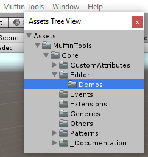

# Muffin Dev for Unity - `AssetsTreeView`

Shortcut to make a tree view of you project's assets.

## Subclasses

* [`FolderInfos`](./folder-infos.md): Contains the name and the path of a folder in the current Unity project

## Demo

You can see a demo render in the menu `Muffin Dev/Demos/Assets Tree View`.

The script relative to it is in `MuffinDev/Core/Editor/Demos/AssetsTreeViewDemoEditor`.



## How to use?

The `AssetsTreeView` class inherits from Unity's [`TreeView`](https://docs.unity3d.com/Manual/TreeViewAPI.html) class, from `UnityEditor.IMGUI.Controls` library.

It can be used the same way in any of your custom Editor views.

### 1. Example

For this example, create a new `EditorWindow` class, that will contain the `AssetsTreeView` GUI:

```cs
using System.Collections.Generic;

using UnityEngine;
using UnityEditor;
using UnityEditor.IMGUI.Controls;

using MuffinDev.Editor;

public class ProjectFinder : EditorWindow
{
    // Used to save the tree view state (open folders, selected ones, ...). We need to serialize this filed, so that state is saved even if you close the Editor with this window open.
    [SerializeField]
    private TreeViewState m_TreeViewState;
    private AssetsTreeView m_AssetsTree;

    [MenuItem("Demos/Project Finder")]
    public static void ShowWindow()
    {
        ProjectFinder finder = GetWindow<ProjectFinder>(true, "Project Finder", true) as ProjectFinder;
        finder.Show();
    }
}
```

### 2. Initialization

Now, you can manage the initialization of the tree view state and the assets tree view:

```cs
private void OnEnable()
{
    // If no state exists (saved on disk), initialize it.
    if(m_TreeViewState == null)
    {
        m_TreeViewState = new TreeViewState();
    }
    m_AssetsTree = new AssetsTreeView(m_TreeViewState);
}
```

You can change the `TreeViewState` data to open, select, hide folders at initialization.

### 3. Display

For displaying the tree view, call the `OnGUI()` method from `TreeView` class. You'll have to pass the display `Rect`, there's no "`GUILayout`" method.

```cs
private void OnGUI()
{
    m_AssetsTree.OnGUI(new Rect(Vector2.zero, position.size));
}
```

If you try this script, at this step, you can go to `Demos/Project Finder`, and you can see your project's assets folders.

### 4. Detect selection

You can use the `OnSelectionChanges` event on `AssetsTreeView` to react on folder selection.

This event receives a `List` or `AssetsTreeView.FolderInfos` instances. Each of it contains the informations about the name and the path to a selected folder.

```cs
private void OnEnable()
{
    // ...
    m_AssetsTree.OnSelectionChanges += OnSelectFolder;
}

private void OnDisable()
{
    m_AssetsTree.OnSelectionChanges -= OnSelectFolder;
}

private void OnSelectFolder(List<AssetsTreeView.FolderInfos> _SelectedFolders)
{
    if (_SelectedFolders.Count > 0)
    {
        foreach(AssetsTreeView.FolderInfos info in _SelectedFolders)
        {
            Debug.Log("Selected folder: " + info);
        }
    }
}
```

### Final code

```cs
using System.Collections.Generic;

using UnityEngine;
using UnityEditor;
using UnityEditor.IMGUI.Controls;

using MuffinDev.Editor;

public class ProjectFinder : EditorWindow
{
    [SerializeField]
    private TreeViewState m_TreeViewState;
    private AssetsTreeView m_AssetsTree;

    private void OnEnable()
    {
        if(m_TreeViewState == null)
        {
            m_TreeViewState = new TreeViewState();
        }
        m_AssetsTree = new AssetsTreeView(m_TreeViewState);
        m_AssetsTree.OnSelectionChanges += OnSelectFolder;
    }

    private void OnDisable()
    {
        m_AssetsTree.OnSelectionChanges -= OnSelectFolder;
    }

    private void OnSelectFolder(List<AssetsTreeView.FolderInfos> _SelectedFolders)
    {
        if (_SelectedFolders.Count > 0)
        {
            foreach(AssetsTreeView.FolderInfos info in _SelectedFolders)
            {
                Debug.Log("Selected folder: " + info);
            }
        }
    }

    [MenuItem("Demos/Project Finder")]
    public static void ShowWindow()
    {
        ProjectFinder finder = GetWindow<ProjectFinder>(true, "Project Finder", true) as ProjectFinder;
        finder.Show();
    }
}
```

## Constructor

```cs
public AssetsTreeView(TreeViewState _State, bool _EnableMultiSelection = false)
```

Creates an instance of `AssetsTreeView`.

* `TreeViewState _State`: The state of the tree view. Allows you to expand, select or hide folders for example
* `bool _EnableMultiSelection = false`: Defines if user is allowed to multi-select folders

## Accessors

```cs
public int GetMatchingPathID(string _Path)
```

Gets the `FolderInfos` instance in the list, that has the given path.

Returns the index of the matching instance, otherwise -1.

---

```cs
public int GetFolderInfos(int _ID)
```

Gets the `FolderInfos` instance at the given index.

## Delegates

```cs
public delegate void DSelectFolders(List<FolderInfos> _SelectedFolders)
```

Used by `OnSelectionChanges` event.

* `List<FolderInfos> _SelectedFolders`: Data of all the selected folders

## Events

```cs
public event DSelectFolders OnSelectionChanges
```

Triggered when one or more folders (if multi-selection enabled) are selected.