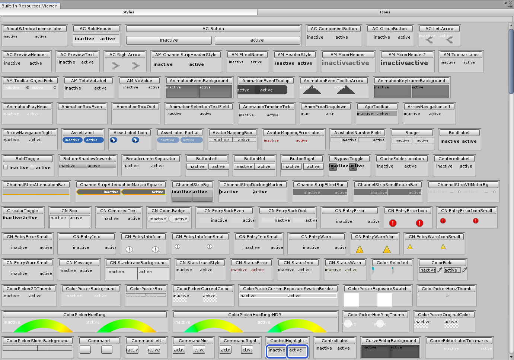

# Muffin Dev for Unity - `Built-In Resources Viewer`

A utility window to display all Unity built-in GUI styles or icons.

Unity already has a lot of GUI styles and icons, either in legacy game GUI or for Editor GUI. All these resources are not documented officially, but you can access it by using functions like `new GUIStyle("Name of a built-in style")`.

The original script can be found on the *Unify Community Wiki*: http://wiki.unity3d.com/index.php/Show_Built_In_Resources

## Usage

Click on the *Styles* or *Icons* tabs to display respectively built-in GUI styles or icons.

You can also use the search bar to check for a keyword or a specific style/icon.

;