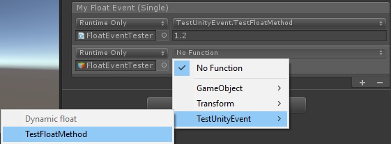

# Muffin Dev for Unity - Core - Events

A collection of "pre-typed" UnityEvents.

## How to use UnityEvents

UnityEvents are an override of C# native events.

You need to add `UnityEngine.Events` library to your scripts in order to use it.

They have a very useful built-in inspector UI. For example, with this simple script:

```cs
public class TestUnityEvent : MonoBehaviour
{
    public UnityEvent myEvent;
}
```

You'll get this field in the Inspector view:


This UI allows you to setup callbacks for this event directly in the Editor. If you use a template version of UnityEvents that takes one parameter, you will be able to set the value of that parameter (if serializable), or use "dynamic" values:

```cs
[System.Serializable]
public class FloatEvent : UnityEvent<float> { }

public class TestUnityEvent : MonoBehaviour
{
    public FloatEvent myFloatEvent;

    public void TestFloatMethod(float param) { }
}
```



[**=> More about UnityEvents**](https://docs.unity3d.com/Manual/UnityEvents.html)

## Events list

### Native types

```cs
public class BoolEvent : UnityEvent<bool>
```

```cs
public class FloatEvent : UnityEvent<Collider>
```

```cs
public class IntEvent : UnityEvent<int>
```

```cs
public class StringEvent : UnityEvent<string>
```

```cs
public class VoidEvent : UnityEvent
```

This one avoids you to use `UnityEngine.Events` to call `UnityEvent` class, while you're already using `MuffinDev.Core`.

### Unity types

```cs
public class Collider2DEvent : UnityEvent<Collider2D>
```

```cs
public class ColliderEvent : UnityEvent<Collider>
```

```cs
public class CollisionEvent : UnityEvent<Collision>
```

```cs
public class QuaternionEvent : UnityEvent<Quaternion>
```

```cs
public class Vector2Event : UnityEvent<Vector2>
```

```cs
public class Vector3Event : UnityEvent<Vector3>
```