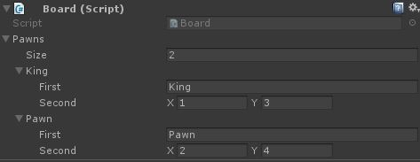

# Muffin Dev for Unity - `Pair`

Simple two-value container template class.

This is a light version of `KeyValuePair` template from `System.Collections.Generics`, also serialized, so values can be displayed in the Inspector view if possible.

## Usage

```cs
[System.Serializable]
public class Pawn : Pair<string, Vector2> { }

public class Board : MonoBehaviour
{
    public Pawn[] pawns;
}
```



## Structure

```cs
public class Pair<T, U>
```

* `T`: The first value type
* `U`: The second value type

## Constructors

```cs
public Pair() { }
```

Creates an instance of `Pair` with default values.

---

```cs
public Pair(T _First, U _Second) { }
```

Creates an instance of `Pair` with given first and second values.

## Accessors

```cs
public T First { get; set; }
```

Gets or sets the first value.

---

```cs
public U Second { get; set; }
```

Gets or sets the second value.