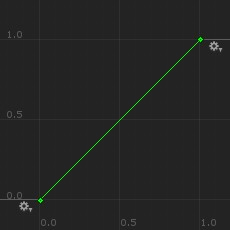
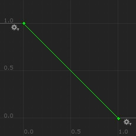
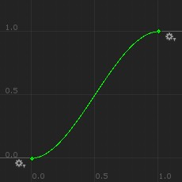
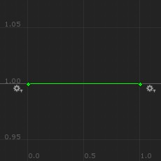
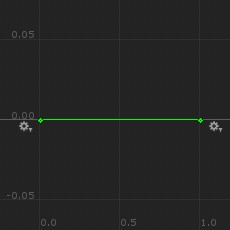

# Muffin Dev for Unity - `AnimationCurves`

Bundle of pre-defined animation curves.

## Values

```cs
public static AnimationCurve Linear { get; }
```



---

```cs
public static AnimationCurve ReverseLinear { get; }
```



---

```cs
public static AnimationCurve EaseInOut { get; }
```



---

```cs
public static AnimationCurve One { get; }
```



---

```cs
public static AnimationCurve Zero { get; }
```

