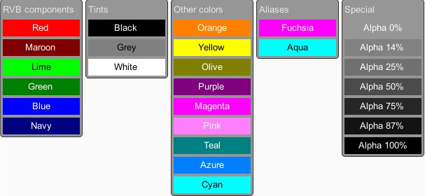

# Muffin Dev for Unity - `Colors`

Utility class and enum for basic colors.



## Usage

The following example shows how to get a `Color` instance using both flags and blends, and the `Colors.Get()` method.

```cs
using UnityEngine;
using MuffinDev;
public class ColorsTester : MonoBehaviour
{
    private void Start()
    {
        // Output: Color(1.000, 0.500, 0.000, 1.000)
        Debug.Log("Orange blend: " + Colors.Get(EColor.Orange));

        // Output: Color(1.000, 0.500, 0.000, 1.000)
        Debug.Log("Orange using flags: " + Colors.Get(EColor.Red | EColor.Green));

        // Output: Color(1.000, 0.500, 0.000, 0.500)
        Debug.Log("Transparent orange: " + Colors.Get(EColor.Orange | EColor.Alpha50));

        // Output: Color(1.000, 0.500, 0.000, 0.500)
        Debug.Log("Transparent orange using flags: " + Colors.Get(EColor.Red | EColor.Green | EColor.Alpha50));
    }
}
```

## `EColor` enum

The `EColor` enum contains both flags and prepared color blends.

Note that values with a specified value can be used as a flag.

```cs
public enum EColor
{
    // RVB components
    Red = 1,
    Maroon = 2,
    Lime = 4,
    Green = 8,
    Blue = 16,
    Navy = 32,
    
    // Tints
    Black = 0,
    Grey = Maroon | Green | Navy,
    White = Red | Lime | Blue,

    // Special
    Alpha0 = 64,
    Alpha14 = 128,
    Alpha25 = 256,
    Alpha50 = 512,
    Alpha75 = 1024,
    Alpha87 = 2048,

    // Other colors
    Orange = Red | Green,
    Yellow = Red | Lime,
    Olive = Maroon | Green,
    Purple = Maroon | Navy,
    Magenta = Red | Blue,
    Pink = Red | Green | Blue,
    Teal = Green | Navy,
    Azure = Green | Blue,
    Cyan = Lime | Blue,

    // Aliases
    Fuchsia = Magenta,
    Aqua = Cyan,
}
```

## `Colors` class

`Colors` is a utility class that contains `Color` static values, and the `Color.Get()` method, which can be used to resolve a `Color` instance from `EColor` flags or blend.

### Properties

```cs
public static readonly Color aqua       = Get(EColor.Aqua);
public static readonly Color azure      = Get(EColor.Azure);
public static readonly Color black      = Get(EColor.Black);
public static readonly Color blue       = Get(EColor.Blue);
public static readonly Color cyan       = Get(EColor.Cyan);
public static readonly Color fuchsia    = Get(EColor.Fuchsia);
public static readonly Color green      = Get(EColor.Green);
public static readonly Color grey       = Get(EColor.Grey);
public static readonly Color lime       = Get(EColor.Lime);
public static readonly Color magenta    = Get(EColor.Magenta);
public static readonly Color maroon     = Get(EColor.Maroon);
public static readonly Color navy       = Get(EColor.Navy);
public static readonly Color olive      = Get(EColor.Olive);
public static readonly Color orange     = Get(EColor.Orange);
public static readonly Color pink       = Get(EColor.Pink);
public static readonly Color purple     = Get(EColor.Purple);
public static readonly Color red        = Get(EColor.Red);
public static readonly Color teal       = Get(EColor.Teal);
public static readonly Color white      = Get(EColor.White);
public static readonly Color yellow     = Get(EColor.Yellow);
```

### Methods

```cs
public static Color Get(EColor _Color)
```

Resolve `Color` instance using given color blend preset or flags (based on `Color.black`).