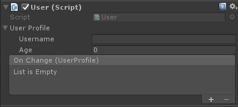

# Muffin Dev for Unity - Core - `ObservableSerialized<T, U>`

Shortcut for making an `Observable` for a serializable property.

This class inherits from `Observable<T>` and already implement what is needed for making a custom observable for serialized properties. But for non-serialized properties, or custom observable behaviour, you can make your own implementation by inheriting from `Observable<T>` directly.

[See `Observable<T>` for more informations](./observable.md)

## How to make a custom observable serialized

In this example, we have a custom serializable class `UserProfile`, and a `User` `MonoBehaviour` in the scene that conatains the user profile data, as an observable.

### Data classes

First, create the data containers.

```cs
[System.Serializable]
public class UserProfile
{
    public string username;
    public int age;
}
```

### Make it observable

Since the `UserProfile` class is serializable and got serialized fields, we can use `ObservableSerialized<T, U>` to make an observable value of `UserProfile`.

The `ObservableSerialized<T, U>` class needs two generic types:

* `T`: The type of the value to observe, here `UserProfile`
* `U`: The `UnityEvent` type to invoke to notify observers of any changes

So, before implementing `ObservableSerialized<T, U>`, we must create an event able to send `UserProfile` new value.

```cs
using UnityEngine.Events;
[System.Serializable]
public class UserProfileEvent : UnityEvent<UserProfile> { }
```

And then, make the observable:

```cs
using MuffinDev;
[System.Serializable]
public class ObservableUserProfile : ObservableSerialized<UserProfile, UserProfileEvent> { }
```

### Use the observable

Now, create a `MonoBehaviour` that contains the observable value.

```cs
using UnityEngine;
public class User : MonoBehaviour
{
    public ObservableUserProfile userProfile = new ObservableUserProfile();

    private void Start()
    {
        // Trigger user profile changes at initialization, and so initialize all observers
        userProfile.Notify();
    }
}
```

If you place this `MonoBehaviour` in your scene, you'll get this field in the inspector:



In the event field, you can click "+" or "-" button to add or remove "observers" (in fact, listeners of the event) directly in the editor.

The event is a `UnityEvent`, so you can also use `userProfile.OnChange.AddListener()` method to add event listeners at runtime.

[See `UnityEvent<T>` for more informations](https://docs.unity3d.com/ScriptReference/Events.UnityEvent_1.html)

### Use the observable in the editor

For now, you can only notify observers from scripting. But if you want to notify observers even when you change manually the values from the Inspector in Play Mode, you have to create an `ObservableDrawer<T>`.

Note that this is an editor class, and **must be placed in an *Editor/* folder**.

```cs
using UnityEngine;
using MuffinDev;
[CustomPropertyDrawer(typeof(ObservableUserProfile))]
public class ObservableUserProfileDrawer : ObservableDrawer<UserProfile>
{

    protected override void OnValueChange(Observable<UserProfile> _Observable, SerializedProperty _ValueProperty)
    {
        // Finds the "username" property as SerializedProperty in UserProfile instance, and gets its string value
        string username = _ValueProperty.FindPropertyRelative("username").stringValue;
        // Same for "age" property, but using its int value
        int age = _ValueProperty.FindPropertyRelative("age").intValue;
        // Trigger changes on the observable
        _Observable.Value = new UserProfile() { username = username, age = age };
    }

    protected override bool CanExpand
    {
        // Since UserProfile class contains nested properties (username and age), you must override CanExpand accessor to avoid bad renderer behavior in the inspector.
        get { return true; }
    }
}
```

With this script placed in your project inside an *Editor/* folder, any changes made from the inspector triggers the event and notifies the observers.

[See `ObservableDrawer<T>` for more informations](./observable-drawer.md)

## Demo

Check the demo scene and scripts of making custom observable serialized in *MuffinDev/Core/Patterns/Demos/CustomObservableSerializedDemo*.

## Constructors

```cs
public ObservableSerialized() { }
```

Creates an instance of ObservableSimple.

---

```cs
public ObservableSerialized(TPropertyType _Value)
```

Creates an instance of ObservableSimple, and initializes its value.

## Methods

```cs
public override void Notify()
```

Triggers the observable's changes event.

---

```cs
protected override void HandleChanges(ObservableChanges<TPropertyType> _Changes)
```

Called when changes event is triggered.

## Accessors

```cs
public TEventType OnChange { get; }
```

Gets the event triggered at each changes of this observable's value.